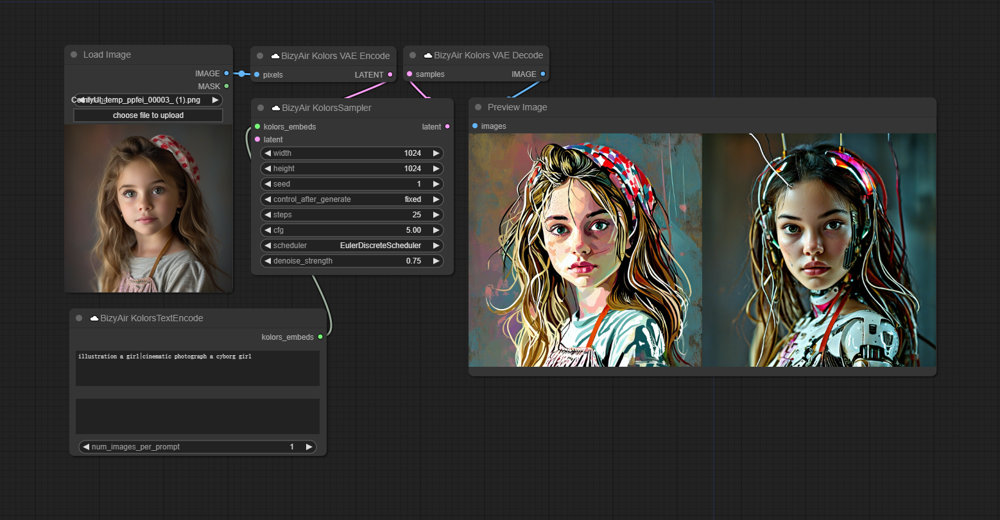
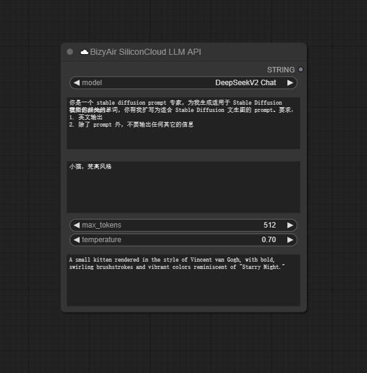

# BizyAir

BizyAir is a collection of [ComfyUI](https://github.com/comfyanonymous/ComfyUI) nodes that help you overcome environmental and hardware limitations, allowing you to more easily generate high-quality content with ComfyUI.





## Table of Contents

- [Features](#features)
- [Installation](#installation)
- [Usage](#usage)

## Features

Run ComfyUI anywhere, anytime, without worrying about the environment or hardware requirements.

## Installation

You can install BizyAir by downloading the BizyAir repository to the custom_nodes subdirectory of ComfyUI by using git clone.

```bash
cd /path/to/ComfyUI && \
git clone https://github.com/siliconflow/BizyAir.git
```

Then, restart ComfyUI. There are some workflow examples in the [examples](./examples) directory.


## Usage

Please see the [Quick Start](https://siliconflow.github.io/BizyAir/getting-started/quick-start.html) page to set up BizyAir.
