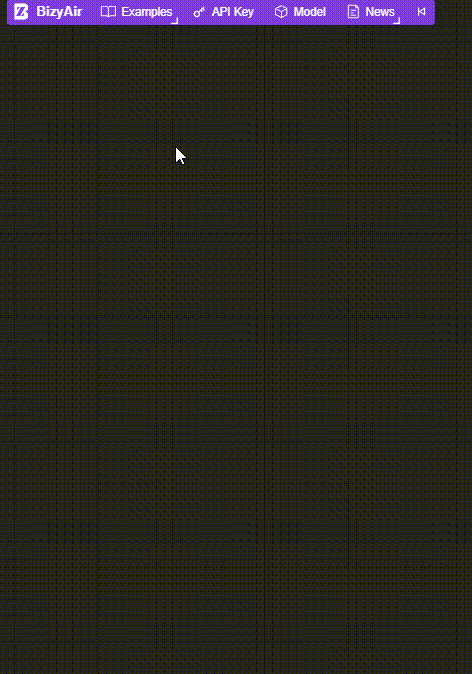

# BizyAir

- [2024/12/17] 🌩️ BizyAir supports Flux Upscale Model. [FLUX Upscale](./examples/bizyair-flux1-upscale.json)
- [2024/11/27] 🌩️ BizyAir supports Stable Diffusion 3.5 Large ControlNet Canny, Depth, and Blur. [ControlNet Canny](./examples/bizyair_sd3_5_canny.json) [ControlNet Depth](./examples/bizyair_sd3_5_depth.json) [ControlNet Blur](./examples/bizyair_sd3_5_blur.json)
- [2024/11/22] 🌩️ BizyAir supports FLUX Fill, ControlNet and Redux modes. [canny](./examples/bizyair-flux1-tools-canny.json) [depth](./examples/bizyair-flux1-tools-depth.json) [fill](./examples/bizyair-flux-fill1-inpaint.json) [redux](./examples/bizyair-flux1-tools-redux.json)
- [2024/11/06] 🌩️ BizyAir PixelWave Flux.1-dev Text to Image node is released. [PixelWave Flux.1-dev Text to Image](./examples/bizyair_flux_pixelwave_txt2img.json)
- [2024/10/30] 🌩️ BizyAir Segment-Anything nodes has been released. [text_guided_segment-anything](./examples/bizyair_text_guided_segment-anything.json) and [box_point_guided_segment-anything](./examples/bizyair_box_point_guided_segment-anything.json)
- [2024/10/24] 🌩️ BizyAir supports stable Diffusion 3.5. [Stable Diffusion 3.5 Text to Image](./examples/bizyair_sd3_5_txt2img.json)
- [2024/10/21] 🌩️ BizyAir supports VLModels. We add a tutorial for utilizing the VLM node. [AI Assistant](https://siliconflow.github.io/BizyAir/ai-assistants/introduce.html)
- [2024/10/11] 🌩️ BizyAir supports PuLID for Flux. [FLUX PuLID workflow](./examples/bizyair_flux_pulid.json)
- [2024/09/29] 🌩️ BizyAir has support to share your custom LoRAs. [Share Your LoRAs](http://bizyair.siliconflow.cn/model-host/sharemodel.html)
- [2024/09/19] 🌩️ BizyAir has updated the model upload feature, allowing the upload process to display a progress bar, and the size of the models uploaded is no longer restricted by ComfyUI. (https://siliconflow.github.io/BizyAir/model-host/introduce.html)
- [2024/09/06] 🌩️ BizyAir supports InstantID for SDXL now. [SDXL InstantID workflow](./examples/bizyair_sdxl_InstantID_basic.json)
- [2024/09/05] 🌩️ BizyAir supports users in running custom LoRA models, including SDXL and Flux LoRA. [How to upload and run custom model](https://siliconflow.github.io/BizyAir/model-host/introduce.html)
- [2024/08/23] 🌩️ BizyAir now support ultimateSDupscale nodes [upscale workflow](./examples/bizyair_ultimate_sd_upscale.json)
- [2024/08/14] 🌩️ BizyAir JoyCaption node has been released. [Try the example to recreate a image by JoyCaption and Flux](./examples/bizyair_flux_joycaption_img2img_workflow.json), thanks to [fancyfeast/joy-caption-pre-alpha](https://huggingface.co/spaces/fancyfeast/joy-caption-pre-alpha)
- [2024/08/05] 🌩️ FLUX.1-dev has been supported. [FLUX.1-dev Text to Image](./examples/bizyair_flux_dev_workflow.json), [FLUX.1-dev Image to Image](./examples/bizyair_flux_img2img_workflow.json)
- [2024/08/02] 🌩️ FLUX.1-schnell has been supported. [FLUX.1-schnell Text to Image](./examples/bizyair_flux_schnell_workflow.json)
- [2024/08/01] 🌩️  [BizyAir MinusZone Kolors](https://siliconflow.github.io/BizyAir/kolors/introduce.html) nodes have been released(thanks to [MinusZoneAI/ComfyUI-Kolors-MZ](https://github.com/MinusZoneAI/ComfyUI-Kolors-MZ)), and BizyAir now supports over 10 new base models. They all support ControlNet, LoRA, and IPAdapter. [BizyAir KSampler](https://siliconflow.github.io/BizyAir/ksampler/introduce.html)
- [2024/07/31] 🌩️ The super-resolution node has been released, capable of enlarging images four times their original size. [BizyAir Photorealistic Image Super Resolution](https://siliconflow.github.io/BizyAir/others/index.html#bizyair-photorealistic-image-super-resolution)
- [2024/07/25] 🌩️ Users can load BizyAir workflow examples directly by clicking the "☁️BizyAir Workflow Examples" button. [Example GIF](./docs/docs/getting-started/imgs/text-guided-segment-anything.gif)
- [2024/07/23] 🌩️ BizyAir ChatGLM3 Text Encode node is released.
- [2024/07/16] 🌩️ [BizyAir Controlnet Union SDXL 1.0](https://siliconflow.github.io/BizyAir/controlnet-union/introduce.html) node is released.
- [2024/07/14] 🌩️ We release Image Caption nodes and add a tutorial for utilizing the LLM node. [AI Assistant](https://siliconflow.github.io/BizyAir/ai-assistants/introduce.html)
- [2024/07/11] 🌩️ We release new nodes that can perform ControlNet preprocessing. [BizyAir Controlnet Auxiliary Preprocessors](https://siliconflow.github.io/BizyAir/controlnet-preprocessor/introduce.html)
- [2024/07/11] 🌩️ We release new nodes, featuring removing image background, photo-quality image generation, and animation super-resolution capabilities.
- [2024/07/10] 🌩️ We release nodes that support Kolors and LLM(large language models).

BizyAir is a collection of [ComfyUI](https://github.com/comfyanonymous/ComfyUI) nodes that help you overcome environmental and hardware limitations, allowing you to more easily generate high-quality content with ComfyUI.


BizyAir now supports many models and nodes.




## Table of Contents

- [Features](#features)
- [Usage](#usage)
- [Installation](#installation)
- [Examples](#examples)


## Features

Run ComfyUI anywhere, anytime, without worrying about the environment or hardware requirements.

## Usage

Please see the [Quick Start](https://siliconflow.github.io/BizyAir/getting-started/quick-start.html) page to set up BizyAir.

Make sure to **set your API KEY** for the **first time** use! You can click on the "click to login" link for a quick setup.


## Installation

You can install BizyAir through several methods: using the ComfyUI Manager, the Comfy CLI, downloading the standalone package for Windows, or by cloning the BizyAir repository into the custom_nodes subdirectory of ComfyUI.

### Method 1: Install via ComfyUI Manager

Assuming your ComfyUI already has the [ComfyUI Manager installed](https://github.com/ltdrdata/ComfyUI-Manager?tab=readme-ov-file#installation), search for BizyAir as shown in the image below. Click "Install" to complete the installation.


### Method 2: Install via git clone

You can install BizyAir by downloading the BizyAir repository to the custom_nodes subdirectory of ComfyUI by using git clone.

```bash
cd /path/to/ComfyUI/custom_nodes && \
git clone https://github.com/siliconflow/BizyAir.git
```

Then, restart ComfyUI.

### Method 3: Install via Comfy CLI

- Prerequisites
    - Ensure `pip install comfy-cli` is installed.
    - Installing ComfyUI `comfy install`

To install the `BizyAir`, use the following command:

```shell
comfy node install bizyair
```


### Method 4: Download windows portable ComfyUI

For NA/EU users:

https://github.com/siliconflow/ComfyUI/releases/tag/latest

For CN users:

https://bizy-air.oss-cn-beijing.aliyuncs.com/new_ComfyUI_windows_portable_nvidia_none_or_cpu.7z


## Examples

There are some workflow examples in the [examples](./examples) directory.
