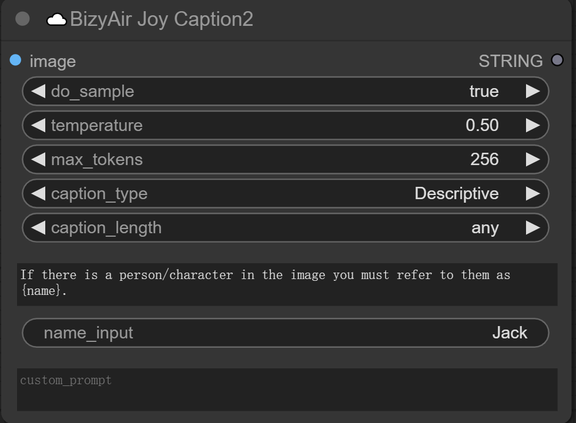
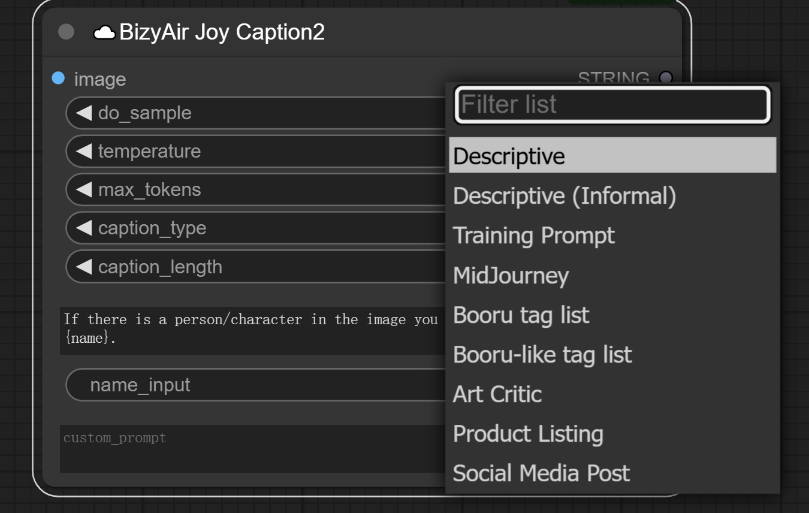

## ☁️BizyAir SiliconCloud LLM API

The "☁️BizyAir SiliconCloud LLM API" node is a cloud-based AI assistant that provides a set of APIs to help you build conversational interfaces.

### Key Features:

1. **Dynamic Models List**: The node automatically fetches and displays a list of all Large Language Models (LLMs) available in your SiliconCloud account. This ensures you always have the most up-to-date options to choose from.

2. **User-Controlled Model Selection**: While the list is dynamically updated, you retain full control over which model to use for your specific needs.

3. **Default Prompt Enhancement**: The default system prompt is designed to enhance your prompt setting experience.

4. **Customizable System Prompts**: You have the freedom to set other system prompts for specific tasks, allowing for flexible use across various applications.

For the most current information on available models and pricing, please refer to the official SiliconFlow website: https://siliconflow.cn/pricing

## ☁️BizyAir SiliconCloud VLM API

The "☁️BizyAir SiliconCloud VLM API" node is a cloud-based AI assistant that provides a set of APIs to help you build conversational interfaces.

### Key Features:

1. **Dynamic Models List**: The node automatically fetches and displays a list of all Vision Language Models (VLMs) available in your SiliconCloud account. This ensures you always have the most up-to-date options to choose from.

2. **User-Controlled Model Selection**: While the list is dynamically updated, you retain full control over which model to use for your specific needs.

3. **Default Prompt Enhancement**: The default system prompt is designed to enhance your prompt setting experience.

4. **Customizable System Prompts**: You have the freedom to set other system prompts for specific tasks, allowing for flexible use across various applications.

For the most current information on available models and pricing, please refer to the official SiliconFlow website: https://siliconflow.cn/pricing

## ☁️BizyAir Joy Caption

The ☁️BizyAir Joy Caption node is a powerful tool designed to automatically generate descriptive captions for images, thanks to https://huggingface.co/spaces/fancyfeast/joy-caption-pre-alpha.

## ☁️BizyAir Joy Caption2

The ☁️BizyAir Joy Caption2 node is an upgraded version of ☁️BizyAir Joy Caption node, thanks to https://huggingface.co/spaces/fancyfeast/joy-caption-alpha-two.

### Key Features:

1. **do_sample**: The do_sample parameter determines whether the model uses a random sampling method to generate the next word, or simply selects the most likely word.

    - `do_sample=True`: It can increased variety and creativity of generated text.

    - `do_sample=False`: The next word with the highest probability will be selected, and the content of the article will be conservative.

2. **temperature**: The temperature parameter affects the shape of the probability distribution when sampling, and thus the variety of generated text.

    - A higher temperature will make the distribution more uniform and increase randomness.

    - A lower temperature makes the distribution sharper, less random, and more inclined to choose words with higher probability.

3. **max_tokens**: The max_tokens parameter specifies the maximum number of tokens that the model can generate when generating text. The upper limit here is 512.

4. **caption_type**: Each caption_type corresponds to the default system prompts.

    

    - **Descriptive**: Write a descriptive caption for this image in a formal tone.

    - **Descriptive (Informal)**: Write a descriptive caption for this image in a casual tone.

    - **Training Prompt**: Write a stable diffusion prompt for this image.

    - **MidJourney**: Write a MidJourney prompt for this image.

    - **Booru tag list**: Write a list of Booru tags for this image.

    - **Booru-like tag list**: Write a list of Booru-like tags for this image.

    - **Art Critic**: Analyze this image like an art critic would with information about its composition, style, symbolism, the use of color, light, any artistic movement it might belong to, etc.

    - **Product Listing**: Write a caption for this image as though it were a product listing.

    - **Social Media Post**: Write a caption for this image as if it were being used for a social media post.

5. **caption_length**: The caption_length parameter is the length of the output. If the max_tokens parameter is less than it, the output will be truncated.

6. **extra_options**: If you want to add more prompts to the default prompts, you can write here.

    - For example, if you want to describe the person in the picture as someone, you can write as follow: `If there is a person/character in the image you must refer to them as {name}.`

7. **name_input**: The name in the *name_input* can replace the `{name}` in the *extra_options*.

    - For example, you write `Jack` here and write `If there is a person/character in the image you must refer to them as {name}.` in the *extra_options*, it will be found that the person in the image is named as Jack in the output.

    

8. **custom_prompt**: If you want to customize the prompts, you can write here to override the prompts and previous actions related to the prompts(*caption_type*, *extra_options* and *extra_options*) will be invalid.
