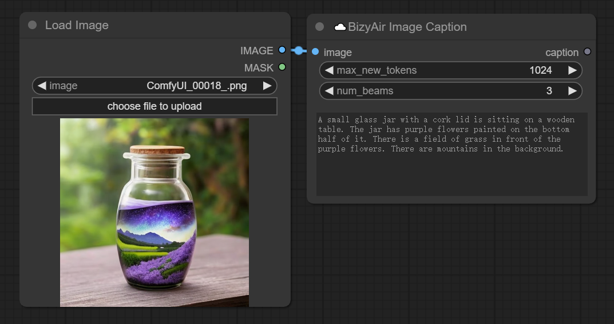
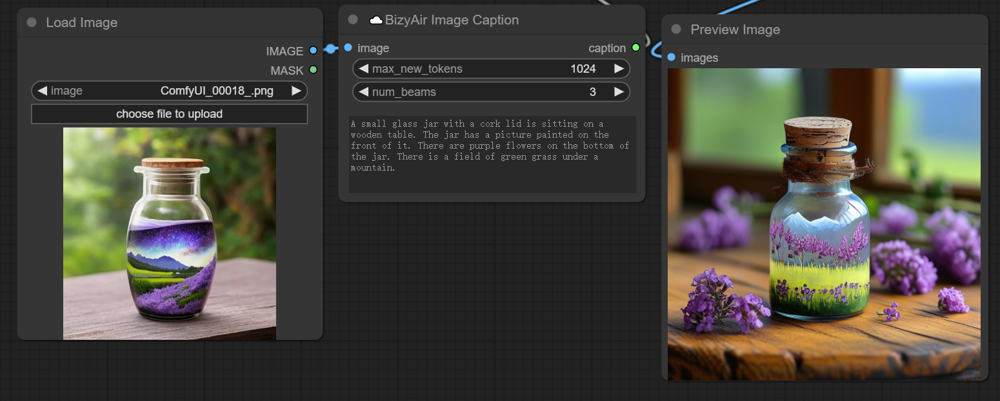

## ☁️BizyAir SiliconCloud LLM API

The ☁️BizyAir SiliconCloud LLM API node is a cloud-based AI assistant that provides a set of APIs to help you build conversational interfaces.

This node offers five Large Langauge Models,  including two completely free models.

 The default system prompt is designed to enhance the prompt setting.

 

You also have the freedom to set other system prompts for specific tasks.

## ☁️BizyAir Image Caption

The ☁️BizyAir Image Caption node is a powerful tool designed to automatically generate descriptive captions for images.

 It is generally very useful in the workflow of redrawing images.

 