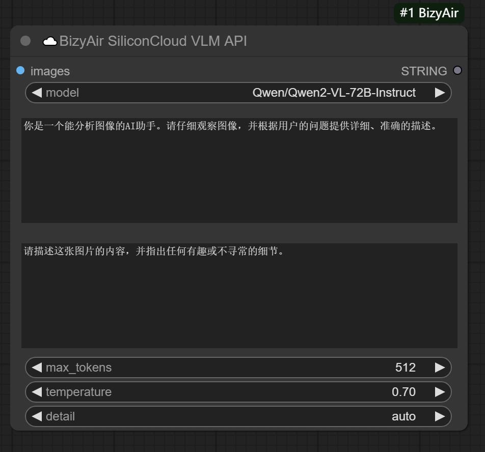

## ☁️BizyAir SiliconCloud LLM API

The "☁️BizyAir SiliconCloud LLM API" node is a cloud-based AI assistant that provides a set of APIs to help you build conversational interfaces.

### Key Features:

1. **Dynamic Models List**: The node automatically fetches and displays a list of all Large Language Models (LLMs) available in your SiliconCloud account. This ensures you always have the most up-to-date options to choose from.

2. **User-Controlled Model Selection**: While the list is dynamically updated, you retain full control over which model to use for your specific needs.

3. **Default Prompt Enhancement**: The default system prompt is designed to enhance your prompt setting experience.

4. **Customizable System Prompts**: You have the freedom to set other system prompts for specific tasks, allowing for flexible use across various applications.

For the most current information on available models and pricing, please refer to the official SiliconFlow website: https://siliconflow.cn/pricing

## ☁️BizyAir SiliconCloud VLM API

The "☁️BizyAir SiliconCloud VLM API" node is a cloud-based AI assistant that provides a set of APIs to help you build conversational interfaces.

### Key Features:

1. **Dynamic Models List**: The node automatically fetches and displays a list of all Vision Language Models (VLMs) available in your SiliconCloud account. This ensures you always have the most up-to-date options to choose from.

2. **User-Controlled Model Selection**: While the list is dynamically updated, you retain full control over which model to use for your specific needs.

3. **Default Prompt Enhancement**: The default system prompt is designed to enhance your prompt setting experience.

4. **Customizable System Prompts**: You have the freedom to set other system prompts for specific tasks, allowing for flexible use across various applications.

For the most current information on available models and pricing, please refer to the official SiliconFlow website: https://siliconflow.cn/pricing

## ☁️BizyAir Joy Caption

The ☁️BizyAir Joy Caption node is a powerful tool designed to automatically generate descriptive captions for images, thanks to https://huggingface.co/spaces/fancyfeast/joy-caption-pre-alpha.
