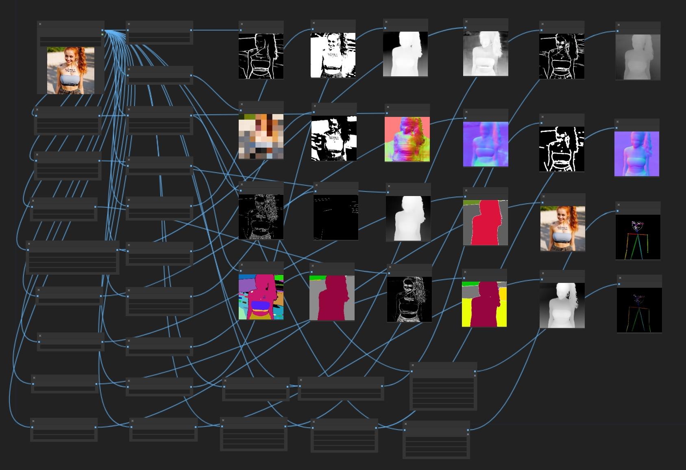

# BizyAir ControlNet Auxiliary Preprocessors

In the workflow of ControlNet, it is usually necessary to have image preprocessing nodes to convert images into Image Prompt that the ControlNet network can use.

BizyAir offers more than 20 ControlNet preprocessing nodes.

 They have the following categories.

## Line Extractors

- ☁️BizyAir PiDiNet Soft-Edge Lines
- ☁️BizyAir Canny Edge
- ☁️BizyAir Binary Lines
- ☁️BizyAir Scribble Lines
- ☁️BizyAir M-LSD Lines
- ☁️BizyAir HED Soft-Edge Lines
- ☁️BizyAir Fake Scribble Lines (aka scribble_hed)
- ☁️BizyAir Realistic Lineart"

## T2I-Adapter Only

- ☁️BizyAir Color Pallete

## Semantic Segmentation

- ☁️BizyAir UniFormer Segmentor
- ☁️BizyAir OneFormer COCO Segmentor
- ☁️BizyAir OneFormer ADE20K Segmentor
- ☁️BizyAir SAM Segmentor

## Normal and Depth Estimators

- ☁️BizyAir Zoe Depth Map
- ☁️BizyAir MiDaS Normal Map
- ☁️BizyAir MiDaS Depth Map
- ☁️BizyAir LeReS Depth Map (enable boost for leres++)
- ☁️BizyAir BAE Normal Map
- ☁️BizyAir Depth Anything V2 - Relative
- ☁️BizyAir Metric3D Depth Map
- ☁️BizyAir Metric3D Normal Map

## Face and Pose Estimators

- ☁️BizyAir OpenPose Pose
- ☁️BizyAir DWPose Estimator

## Tile

- ☁️BizyAir Tile

