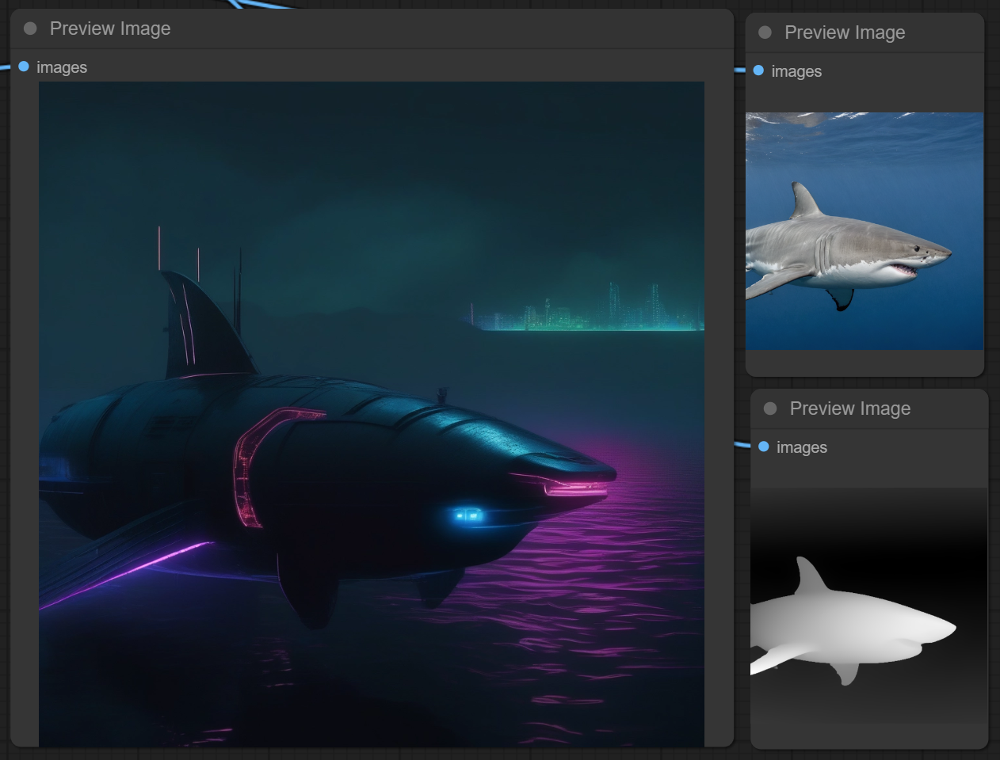

## ☁️BizyAir Controlnet Union SDXL 1.0

☁️BizyAir Controlnet Union SDXL 1.0 integrates the project [controlnet-union-sdxl-1.0](https://huggingface.co/xinsir/controlnet-union-sdxl-1.0) . With this node, you can generate images using various control types.

In conjunction with the [controlnet preprocessors](../controlnet-preprocessor/introduce.md) already provided by BizyAir, you do not need to prepare models and environments; you can directly perform tasks like image-to-image generation.

Here is an example: converting a photo of a great white shark into a depth map and then drawing a cyberpunk-style submarine. You can find similar examples in the repository under the examples section.

!!! note
    The complete workflow can be found at: [github.com/siliconflow//BizyAir/blob/master/examples](https://github.com/siliconflow/BizyAir/blob/master/examples/bizyair_controlnet_union_workflow.json).

    Click the provided link above to get it.

Looking forward to sharing more of your creative uses, enjoy!

## Parameter Explanation

Here are 6 types of inputs, each corresponding to a specific type of ControlNet control image, and they are all of the `IMAGE` type.

- openpose_image
- depth_image
- hed_pidi_scribble_ted_image
- canny_lineart_anime_lineart_mlsd_image
- normal_image
- segment_image

If you are unsure how to obtain such images, you can use the [BizyAir ControlNet Preprocessor](../controlnet-preprocessor/introduce.md) to generate them. You can use one or more control images simultaneously, for example, connecting both `openpose_image` and `depth_image`. However, from a practical view, it is not recommended to connect more than two control images simultaneously.

`prompt` and `negative_prompt` correspond to the positive and negative prompts, respectively.

- A higher value for `guidance_scale` results in images that more closely follow the input prompt.

`control_guidance_start` and `control_guidance_end` are values between 0 and 1. They indicate the proportion of the total steps during which ControlNet is applied. For example, if the total number of steps is set to 20, and `control_guidance_start=0`, `control_guidance_end=0.5`, only the first 10 steps will be influenced by the control image.
