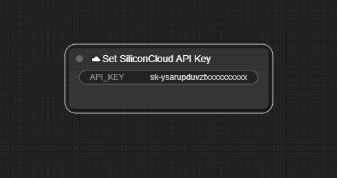

# Getting Started

## 1. Setting API Key

For the first use, you need to set your API key using "Set SiliconCloud API Key". Add the "Set SiliconCloud API Key" node and run it(click "Queue Prompt" button). The key changes to "**********", indicating successful operation.

You **should** then remove this node.

## 2. Using BizyAir Nodes

All BizyAir nodes are under the "☁️BizyAir" category. Taking "☁️BizyAir SiliconCloud LLM API" node as an example, it can assist you by leveraging a LLM (large language model) to refine prompts, translate, or perform any other tasks you want it to do.

or you can use [Kolors](../kolors/introduce.md) nodes to generate images.

