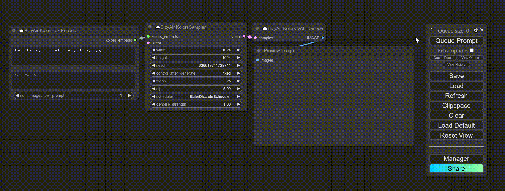
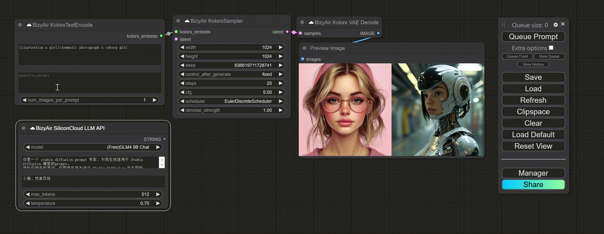

# Getting Started

## 1. Setting API Key

For the first use, you need to set your API key using "Set SiliconCloud API Key". Add the "Set SiliconCloud API Key" node and run it(click "Queue Prompt" button). The key changes to "**********", indicating successful operation.

!!! note
    You **should** remove this node after you set the key.

!!! note
    You don't need to set the key every time you start the program. The key is cached in your local browser, and as long as you don't get a pop-up prompt asking you to enter the key, you can continue to use BizyAir Nodes.

## 2. Using BizyAir Nodes

All BizyAir nodes are under the "☁️BizyAir" category.

Here is a simple example of using the Kolors nodes.

or you can use LLM to refine your prompt.

