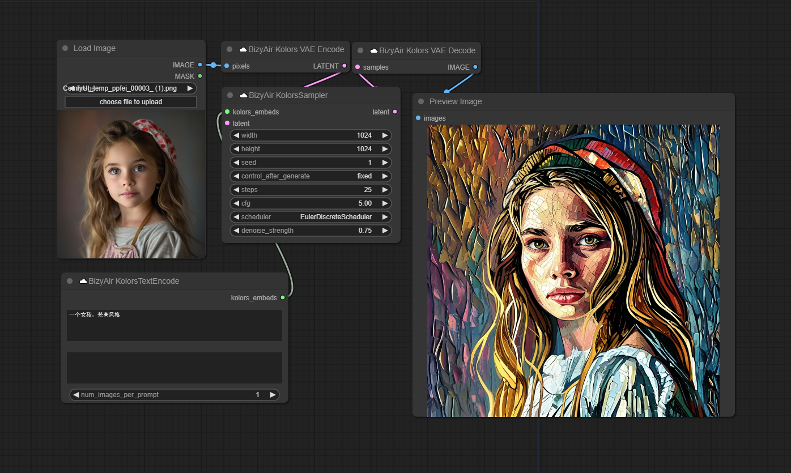
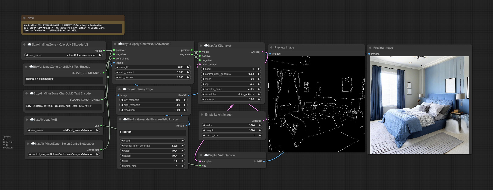
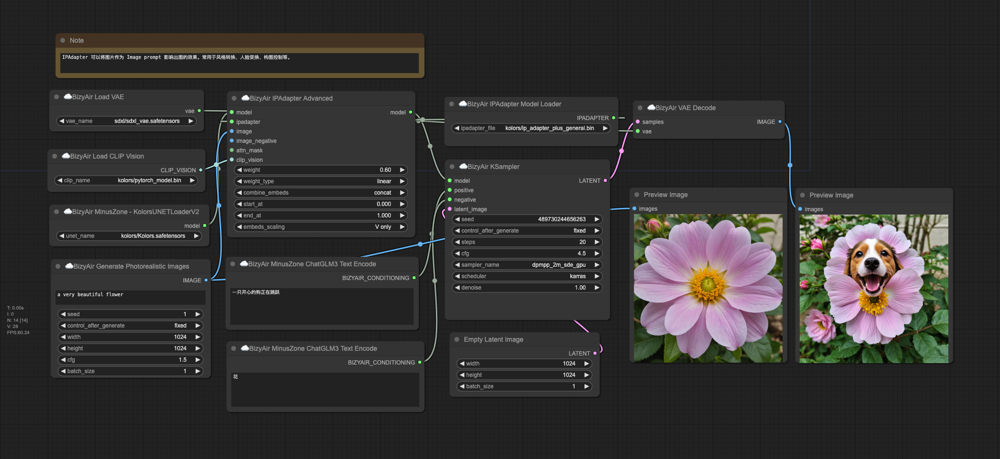

# Kolors

Kolors is a large-scale text-to-image generation model based on latent diffusion, developed by the Kuaishou Kolors team.

You can find more about Kolors at [Kwai-Kolors/Kolors](https://huggingface.co/Kwai-Kolors/Kolors).

All the specific Kolors related nodes are placed in the category "☁️BizyAir/Kolors". They can be used with the generic nodes such as  "☁️BizyAir KSampler" and "☁️BizyAir VAE Decode" and so on.

Here is an example of a text-to-image workflow using Kolors:

Here is an example of a depth controlnet image-to-image workflow using Kolors:

You can alose use the canny controlnet with kolors:

Here is an example of inpainting workflow using Kolors. We mask the cat and change it to a dog:

Here is an example of IPAdapter workflow using Kolors:

 The nodes provided by BizyAir are compatible with the nodes provided by [MinusZoneAI
/
ComfyUI-Kolors-MZ](https://github.com/MinusZoneAI/ComfyUI-Kolors-MZ) , allowing you to freely combine them.

Enjoy.
