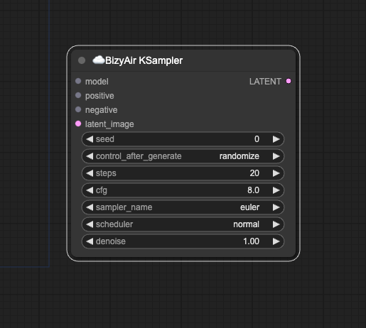
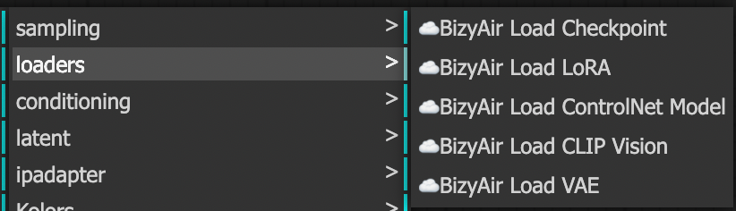
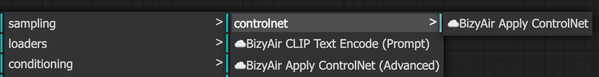
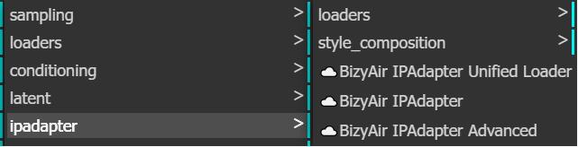
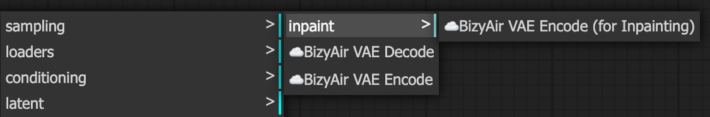

#  ☁️BizyAir KSampler and Its Supporting Infrastructure.

 In BizyAir, there is a KSampler node provided along with other matching nodes.
 These can handle tasks such as text to image, image to image, inpainting, outpainting, LoRA, ControlNet, IPAdapter, and more.
 
 Utilizing cloud resources, there is no need to download models or use local graphics cards, yet the usage habits remain consistent with the native ComfyUI.

## ☁️BizyAir KSampler

- positive: the positive prompt
- negative: the negative prompt
- latent_image: the latent of the input image, it also can be a empty latent created by "Empty Latent Node"
- seed: when the seed doesn't change, the output image will remain the same
- control_after_generate: whether the seed needs to be changed after each wokflow running
- steps: the sampling steps, the more steps, the more time it will take to generate a image
- cfg:  a higher cfg value will result in output images that are closer to the input prompt, while a lower cfg value will lead to more creative results
- denoise: the strength during the sampling process

## Loaders

In the category "☁️BizyAir/loaders", you can see the loaders matching "☁️BizyAir KSampler". There are:

- ☁️BizyAir Load Checkpoint
- ☁️BizyAir Load LoRA
- ☁️BizyAir Load ControlNet Model
- ☁️BizyAir Load CLIP Vision
- ☁️BizyAir Load VAE

!!! note
      Currently, local models cannot be used in BizyAir. In the future, we will introduce a feature for uploading local models.

## Conditioning Nodes

In the category "☁️BizyAir/conditioning", you can see the nodes controling the output image conditions. There are 1 node for text encoding and two nodes for applying controlnet.

## IPAdapter

In the category "☁️BizyAir/ipadapter", you can see the nodes about IPAdapter. Its usage is consistent with [cubiq/ComfyUI_IPAdapter_plus](https://github.com/cubiq/ComfyUI_IPAdapter_plus).

## Latent Encode and Decode

In the category "☁️BizyAir/latent", you can see the nodes working with latent. There are:

- ☁️BizyAir VAE Decode: convert the latent to image
- ☁️BizyAir VAE Encode: convert the image to latent
- ☁️BizyAir VAE Encode(for Inpainting): used with the mask for inpainting

