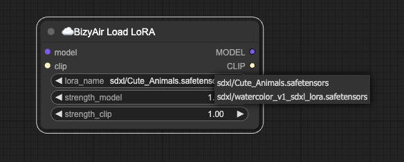
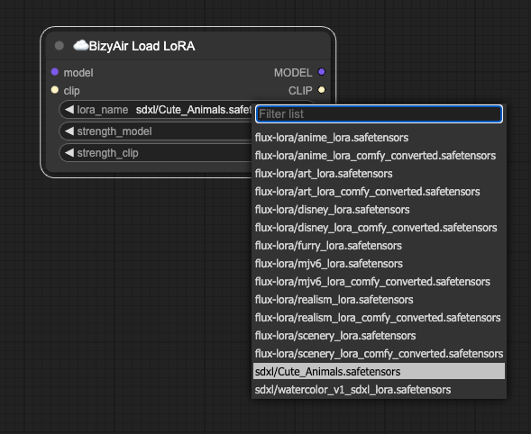
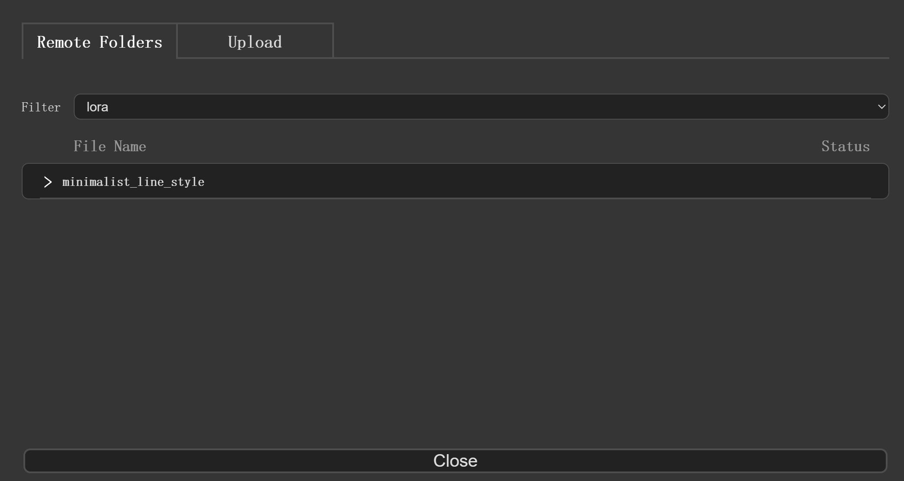
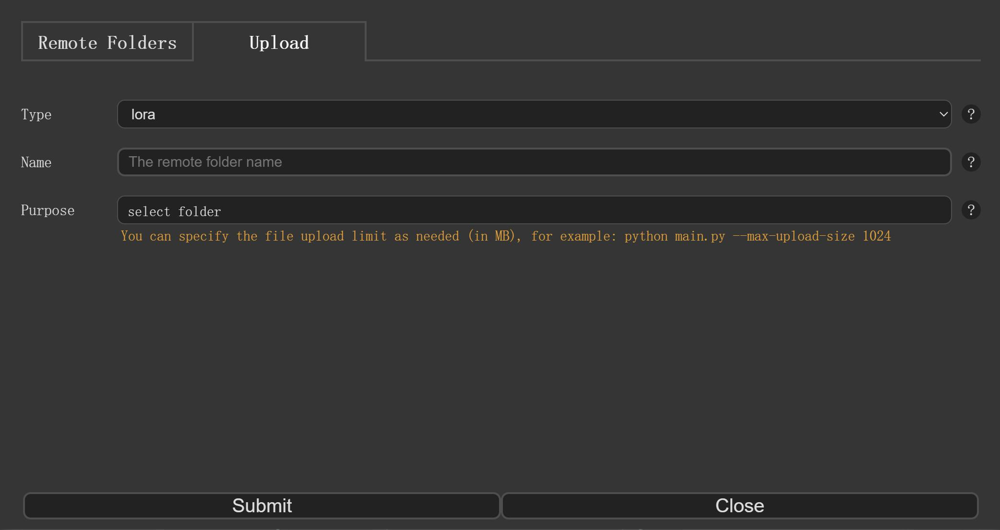
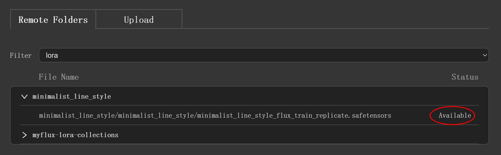

# 使用自定义 LoRA 模型

如果想使用本地的模型，可以先将模型上传，然后使用 BizyAir 的节点进行加载。
目前已经支持 SDXL、Flux 的 LoRA 模型的上传和使用。

默认情况下，`BizyAir Load LoRA` 节点只会显示少数示例模型。



上传后自定义模型后，`BizyAir Load LoRA` 节点会显示示例模型及用户的自定义模型。



!!! note
    用户上传的模型，仅用户自己可见。

用户可以在 ComfyUI 中上传模型，也可以使用命令行工具上传模型。

## 在 ComfyUI 中上传模型

!!! note
    ComfyUI 默认传输数据大小为 100MB，建议启动时，将最大值设置大一些，如 `python main.py --max-upload-size 1000` 设置最大上传数据为 1000MB。

点击 BizyAir 的 "Model" 按钮，可以打开模型对话框。


在 “Remote Folders” 中可以查看已经上传的模型。



在 “Upload” 中可以上传模型。



## 使用 SiliconCloud Client 上传模型

!!! note
    如果你不熟悉命令行，请改用 [ComfyUI 中上传模型](#comfyui) 的方法。

为了上传模型，需要下载命令行工具：https://github.com/siliconflow/siliconcloud-cli/releases/tag/v0.1.1

请根据自己的 操作系统 和 芯片类型 选择正确的客户端下载。

下载解压后，得到可执行文件 siliconcloud (windows 版是 siliconcloud.exe)。

请确保 Linux/Mac 下它有执行权限，或者用以下命令加上执行权限。

```
chmod u+x siliconcloud
```

### 登录

运行以下命令登陆

```bash
siliconcloud login --api_key $APIKEY
```

`$APIKEY` 为你在 https://cloud.siliconflow.cn 中生成的 API Key。


### 上传模型

```bash
siliconcloud  upload --type "bizyair/lora" --path /localpath/XLabs-AI/flux-lora-collection --name myflux-lora
```

参数解释：

- `--type "bizyair/lora"` 当前只支持 lora 模型的运行，所以需要使用这个 type
- `/localpath/XLabs-AI/flux-lora-collection` 请把这个路径改成你计算机上需要上传的模型的真实 **目录** 的路径。整个目录中的 **所有文件** 将会被上传
- `--name myflux-lora` 指定上传后的远程目录名为 myflux-lora

## 使用上传的模型

当模型的状态显示为 “Available” 时，表示模型已经可以在 BizyAir 工作流中使用。



!!! note
    上传的模型，即使完成后，也需要一定时间才能在 BizyAir 中使用，一般为 20~30 分钟。如果状态不为 “Available”，请稍等片刻。

在 BizyAir 中，使用 `BizyAir Load LoRA` 节点，可以加载上传的模型。

示例工作流： [Flux LoRA](https://github.com/siliconflow/BizyAir/blob/master/examples/bizyair_flux_simple_lora_workflow.json)
