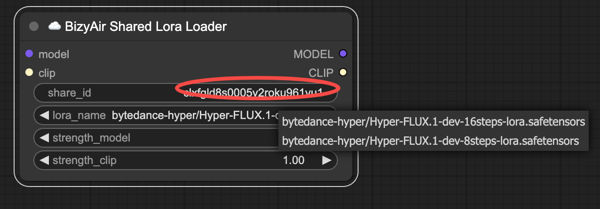
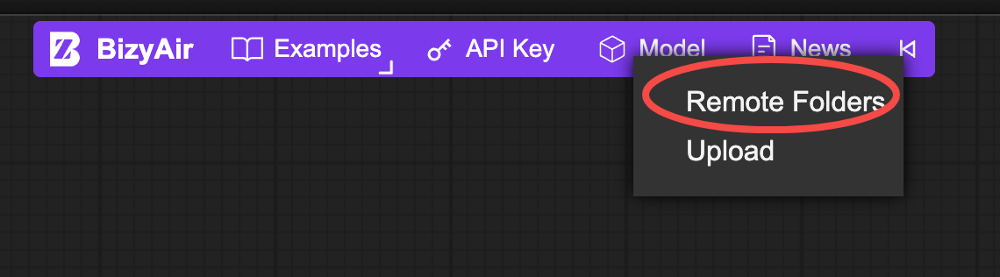
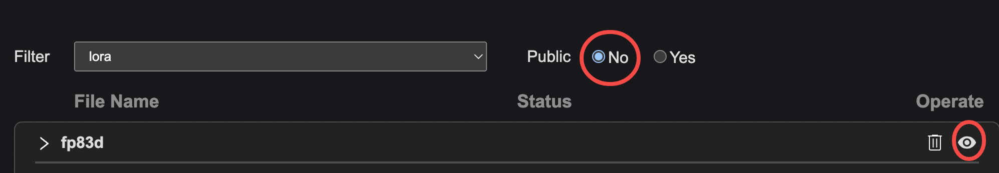
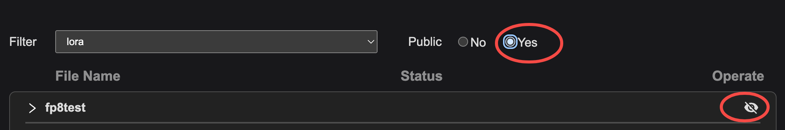
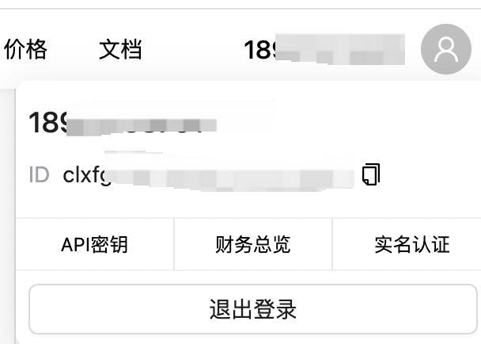

# 分享自定义的 LoRA 模型

用户可以将已经上传的 BizyAir 模型设置为公开模式。这样可以直接让其他用户使用。

## 将模型设置为公开

点击 “Model/Remote Folders” 菜单。

默认情况下，上传的模型都是非公开形式的，需要点击如图红圈所示的按钮，将模型设置为公开。

切换到 Public "Yes" 的标签栏，可以查看已经设置为公开的模型，点击如图所示的标志，可以取消公开该模型。

!!! note
    已经公开的模型是不能删除的，如果想删除公开的模型，需要先将其设置为非公开，再在非公开的标签页中删除该模型。

## 使用公开的自定义 LoRA 模型

使用 "☁️BizyAir Shared Lora Loader" 节点，即可显示指定 shareid 下的公开 LoRA。

## 如何获取自己的 share id

登陆 [cloud.siliconflow.cn](https://cloud.siliconflow.cn)，点击右上角，可以查看并复制自己的 share id。

